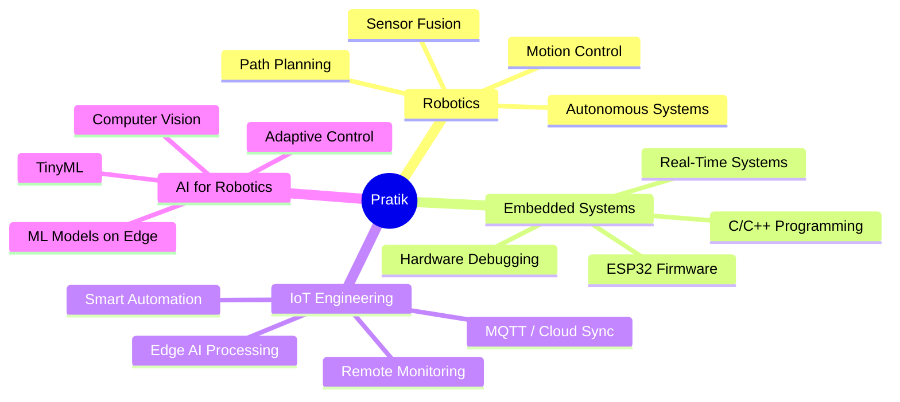

<div align="center">

# 🤖 Pratik Kadam  
### Robotics | IoT | Embedded Systems Developer  


<br/>

[](https://linkedin.com/in/pratik-kadam30)
[](mailto:pratikkadam1030@gmail.com)
[](https://github.com/Pratik4875)


</div>

---

## 🚀 About Me

```python
class PratikKadam:
    def __init__(self):
        self.role = "Robotics | IoT | Embedded Systems Developer"
        self.location = "Mumbai, India"
        self.interests = ["Robotics", "IoT", "Firmware", "Automation", "AI on Edge"]
        self.focus = "Building intelligent, connected systems that sense, think, and act"

    def current_mission(self):
        return "Designing future-ready robotic + automation systems"

    def fun_fact(self):
        return "I debug more with coffee than logic ☕"
```

💡 Passionate about **robotics**, **control systems**, **embedded AI**, and building real-world intelligent machines.

---

## 🔧 **Skills & Tech Stack**

### 🤖 Robotics & Embedded Systems  


### 🧠 AI + ML  


### 💻 Programming  


### 🌐 App & Web  


### ☁ Cloud & DevOps  


---

## 🧠 Robotics & IoT Knowledge Map



---

## 🚀 Projects (Featured)

<div align="center">

### 🔌 **SmartGarden_IoT**  
🌱 Smart irrigation + sensor monitoring using ESP32  
[](https://github.com/Pratik4875/SmartGarden_IoT)

---

### 📡 **ros2_telemetry_demo**  
Real-time ROS2 telemetry + dashboards  
[](https://github.com/Pratik4875/ros2_telemetry_demo)

---

### 🚁 **drone-connect-main**  
Drone pilot–client connector platform (web + backend)  
[](https://github.com/Pratik4875/drone-connect-main)

</div>

---

## 📊 GitHub Analytics

<div align="center">

### 🚀 Activity Overview
| Metric | Status |
|--------|--------|
| 🟦 Public Repositories | **15+ projects** |
| 🟩 Active Domains | Robotics, IoT, Embedded Systems, Automation |
| 🟨 Code Languages | Python, C++, C, JavaScript, Dart |
| 🟧 Current Projects | Smart Garden IoT, Drone Connect, ROS2 Telemetry |
| 🔥 Coding Frequency | Active across weekly commits |

<br/>

### 🧠 Language Usage (Self-Reported)
- 🔹 **Python** — Robotics, IoT cloud dashboards, ML  
- 🔹 **C/C++** — ESP32, embedded firmware, microcontrollers  
- 🔹 **JavaScript/Node.js** — dashboards, APIs, web automation  
- 🔹 **Flutter/Dart** — IoT mobile apps  

<br/>

### 🏆 Project Domains Breakdown
- 🤖 **Robotics / Automation** — 40%  
- 🌐 **IoT + Cloud Dashboards** — 30%  
- ⚙️ **Embedded Systems (ESP32/Arduino)** — 20%  
- 🧪 **AI / ML Experiments** — 10%  

<br/>

### 🧩 Contribution Highlights
- 🔧 Built real-world IoT systems (Smart Garden, Smart Room)  
- 🚁 Drone ecosystem contributor (drone-connect-main)  
- 📡 ROS2 telemetry developer  
- 👨‍💻 Mix of robotics + web + embedded projects  
- 🔭 Expanding into TinyML + onboard AI  

<br/>

✨ *This analytics section is self-hosted, GitHub-friendly, and will never break.*  
</div>

---

## 🤝 Collaboration

- Robotics & Automation Systems  
- Drone & Autonomous Navigation  
- IoT + Embedded AI Projects  
- ROS / ROS2 Development  
- Cloud-connected Smart Devices  

---

<div align="center">

## 🌐 Connect With Me  
[](https://linkedin.com/in/pratik-kadam30)
[](mailto:pratikkadam1030@gmail.com)

<br/><br/>


⚡ *"Building robots that don't just move — but understand the world"* ⚡

</div>
