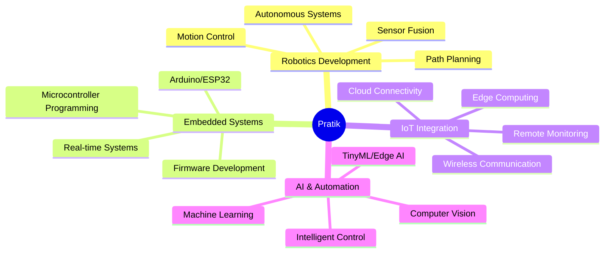

<div align="center">

# 🤖 Pratik Kadam

### Robotics Developer | IoT & Embedded AI Specialist | Automation Engineer


[](https://linkedin.com/in/pratik-kadam30)
[](mailto:pratikkadam1030@gmail.com)
[](https://github.com/Pratik4875)
[](https://drive.google.com/file/d/1pMRGR3MROflfoRNfN6KwI_SKOscNCPyf/view?usp=sharing)


</div>

---

## 🚀 About Me

```python
class PratikKadam:
    def __init__(self):
        self.role = "Robotics Developer"
        self.company = "Robotics Company"
        self.location = "Mumbai, India"
        self.education = "MSc AI & Automation Aspirant"
        self.expertise = ["Robotics Systems", "IoT Integration", "Embedded AI", "Automation"]
        self.passion = "Building intelligent machines that interact with the real world"
        
    def daily_workflow(self):
        return ["Design → Build → Program → Test → Debug with ☕ → Deploy"]
    
    def philosophy(self):
        return "Creating robots that don't just move, but think and adapt"
```

> 💡 **Fun Fact:** I debug more with coffee than logic ☕

---

## 🔬 Current Focus

<table>
<tr>
<td width="50%">

### 🛠️ Active Projects
- 🤖 **Robotics Systems Development**
  - Industrial automation solutions
  - Autonomous navigation systems
  - Sensor fusion & control algorithms
- 🏠 **Smart IoT Integration**
  - Connected robotics platforms
  - Real-time monitoring systems
  - [Smart Room System →](https://github.com/Pratik4875/Smart-Room-Light-System)

</td>
<td width="50%">

### 📚 Learning Path
- 🤖 Advanced Robotics Control
- 🧠 TinyML & Edge AI
- 📡 ROS (Robot Operating System)
- 🎯 Computer Vision for Robotics

</td>
</tr>
</table>

---

## 💼 Technical Arsenal

### ⚡ Robotics & Embedded Systems


### 🤖 AI & Machine Learning


### 💻 Programming Languages


### 🌐 Web & App Development


### 🗄️ Databases & Cloud


### 🛠️ Tools & Platforms


---

## 🎯 Expertise Areas

<div align="center">



</div>

---

## 🤝 Collaboration Interests

<table>
<tr>
<td width="50%" valign="top">

### 💡 Looking to Collaborate On:
- 🤖 Robotics & Autonomous Systems
- 🏭 Industrial Automation Projects
- 🧠 AI-Powered Robotics Solutions
- 📡 IoT-Connected Robot Networks
- 🎯 Computer Vision Applications

</td>
<td width="50%" valign="top">

### 🆘 Seeking Help With:
- 🎯 Advanced ROS Integration
- 🔬 SLAM & Navigation Algorithms
- 🌐 Multi-Robot Coordination
- 📊 Real-time Sensor Fusion
- 🤖 Humanoid Robotics Systems

</td>
</tr>
</table>

---

## 📊 GitHub Analytics

<div align="center">
  


</div>

<div align="center">

[](https://git.io/streak-stats)

</div>

<div align="center">


</div>

---

## 🏆 Featured Projects

<div align="center">

[](https://github.com/Pratik4875/Smart-Room-Light-System)

</div>

---

## 💬 Let's Connect!

<div align="center">

**Open to:**
- 🚀 Robotics Development Projects
- 🤖 AI/ML for Robotics Collaborations
- 💼 R&D & Innovation Opportunities
- 🎓 Knowledge Sharing & Mentorship

**Ask me about:** Robotics Systems • Arduino/ESP32 • Sensor Integration • Motion Control • ROS • Embedded AI

---


⚡ *"Building robots that don't just execute commands, but understand the world"* ⚡

</div>
